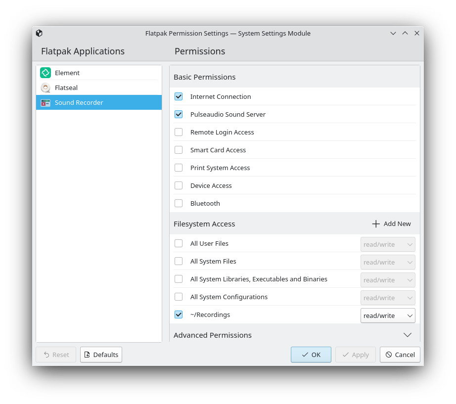
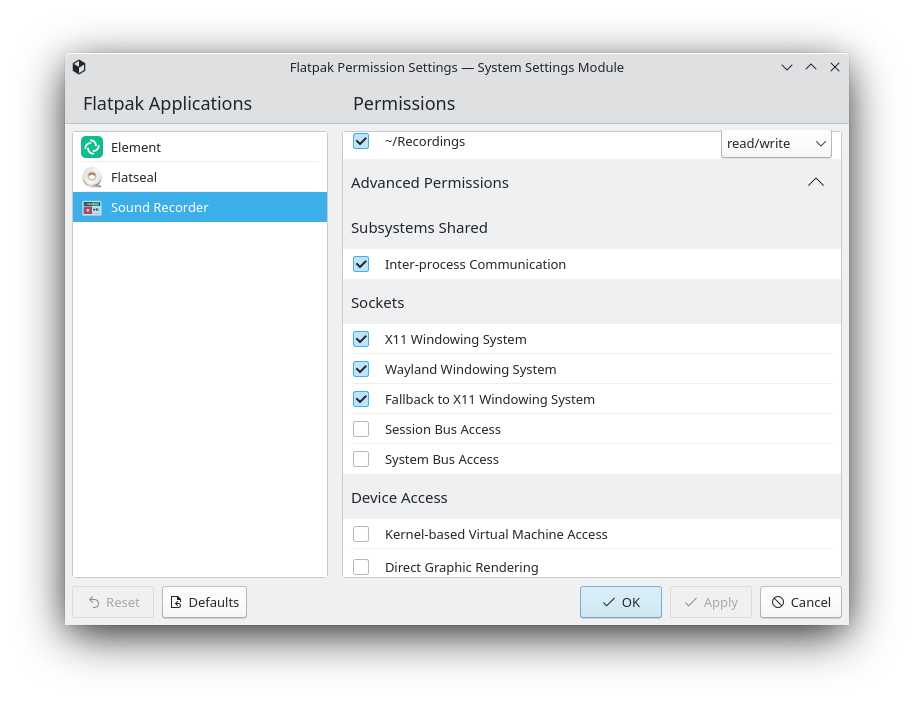

<!---
SPDX-FileCopyrightText: 2022 Suhaas Joshi <joshiesuhaas0@gmail.com>
SPDX-License-Identifier: GPL-2.0-or-later
-->

# Flatpak Permissions Management KCM

The KCM allows changing what permissions have been granted to installed Flatpak applications.

## Building and Running:

- cd wherever/you/like
- git clone [ the link you copy from the clone option ]
- cd flatpak_kcm
- mkdir build
- cd build
- cmake .. -DCMAKE_INSTALL_PREFIX=~/.local/kde
- make install
- source prefix.sh
- kcmshell5 kcm_flatpak
